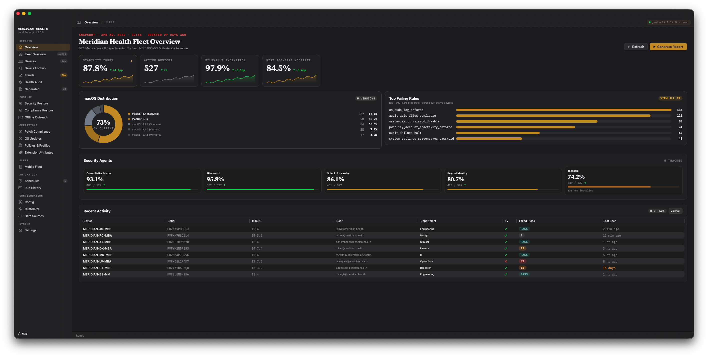

# jamf-reports-community

Fleet reporting for Jamf Pro and Jamf School — a native macOS app. Turn Jamf inventory into
formatted Excel workbooks, self-contained HTML reports, and historical trend dashboards. No
Power BI, no custom infrastructure, no hardcoded credentials.

Featured in the [jamf-cli Community Showcase](https://github.com/Jamf-Concepts/jamf-cli/wiki/Community-Showcase).



---

## The macOS app

The native SwiftUI app (macOS 14+) is a complete reporting console: collect data from Jamf
Pro, generate workbooks and HTML reports, schedule unattended runs, and review fleet health
over time — all from a GUI.

It works from a Jamf Pro CSV export, live `jamf-cli` data, or cached snapshots — whatever
you have. A guided first run gets you from a blank Mac to a first report.

### Dashboards

Screens are organized into four groups:

- **Reports** — fleet Overview, multi-profile Fleet Overview, device inventory, device
  lookup, Historical Trends, and an instance Health Audit.
- **Posture** — a weighted Security Score, Compliance Posture banding, and stale-device
  Offline Outreach.
- **Operations** — Patch Compliance, OS Updates, Policies & Profiles, and Extension
  Attributes.
- **Fleet** — iOS/iPadOS Mobile Fleet and Jamf Protect.

Every non-core dashboard is toggleable, so unused screens disappear from the sidebar.

### Highlights

- **Configurable Security Score** — a weighted posture score (FileVault, SIP, firewall,
  Gatekeeper, and more), with the weights editable in the app.
- **Historical Trends** — Swift Charts over archived `summary.json` snapshots, with a
  configurable trend range.
- **Automation by policy** — instead of hand-building cron jobs, set one policy: the app
  keeps every profile's data fresh daily (heavy per-device scans weekly) and generates
  reports on your chosen cadence — across all profiles, adjusting as profiles are added or
  removed. Optional weekly configuration backups, per-profile exclusions, and a catch-up
  collect when a laptop sleeps through the scheduled time.
- **Report groups & consolidated reports** — group profiles (combine prod/dev/sandbox as
  one fleet, or one group per customer) into a consolidated report with device-weighted
  KPIs and period-over-period delta columns.
- **Opt-in notifications** — post a "report generated" digest to a Microsoft Teams or Slack
  webhook (off by default).
- **Native report engine** — every workbook, HTML report, and PDF is generated by a
  native Swift engine.

### First run and multiple tenants

A guided onboarding flow installs and authenticates `jamf-cli`, creates your first
profile, and produces a first report — no terminal required. Teams and MSPs can run
several profiles side by side: each profile is an isolated workspace with its own data,
config, schedules, and generated reports, switchable from the sidebar.

### Requirements and install

macOS 14 or later. [jamf-cli](https://github.com/Jamf-Concepts/jamf-cli) v1.18.0+ is
optional — it powers live collection, but the app also works from CSV exports and cached
snapshots.

Download the latest notarized `.dmg` or `.pkg` from the
[Releases page](https://github.com/tonyyo11/jamf-reports-community/releases), or build from
source:

```bash
cd app
./build-app.sh release             # → app/build/JamfReports.app
```

See [`app/README.md`](app/README.md) for the full build, signing, and notarization steps.

### OS currency and patch release dates

- **OS Currency** — an "OS Currency" workbook sheet and HTML card show the latest available
  macOS/iOS/iPadOS/tvOS/watchOS versions from the [SOFA](https://sofa.macadmins.io) feed,
  joined to your fleet's OS distribution. Configure it in the `sofa:` block; set
  `sofa.enabled: false` for air-gapped use.
- **Patch release dates** — the Patch Compliance sheet gains "Latest Released" and
  "Days Behind" columns when patch-title definitions are collected.

---

## Documentation

**Full setup and usage:**
the [project wiki](https://github.com/tonyyo11/jamf-reports-community/wiki) covers
installation, the app walkthrough, dashboards, scheduling, configuration, and Jamf School.

- [`CHANGELOG.md`](CHANGELOG.md) — release history.
- [`docs/testing.md`](docs/testing.md) — the Swift test suite.
- [`docs/architecture/`](docs/architecture) — design decisions and the threat model.

### Diagnostic bundles

The app's Settings → "Generate diagnostic bundle now" packages recent logs, snapshots, and
a redacted `config.yaml` into a shareable zip. Credentials are always redacted; PII
(hostnames, serials, emails, device names) is redacted by default. Two redaction limits are
worth knowing before you share a bundle:

- **Jamf reached by IP address is not redacted.** The hostname redactor matches URLs with
  an alphabetic TLD (`https://acme.jamfcloud.com/…`), so an on-prem instance addressed by
  IP (`https://10.0.0.5/…`) passes through un-redacted. If your Jamf Pro is reachable by IP,
  generate the bundle for local debugging only — do not share it externally — or scrub the
  IP by hand first.
- **Profile slugs and schedule labels are not redacted.** They appear verbatim in the
  bundle's manifest, file names, and workspace tree listing. Keep profile slugs and
  LaunchAgent schedule labels non-identifying (avoid org names, site codes, or personal
  identifiers) so a shared bundle stays tenant-safe.

Found a problem? Open an issue with the error message and the relevant part of your
`config.yaml` (secrets redacted). The Run History screen streams full `jamf-cli` output for
any run — attach that for collection failures.

---

## License

MIT — see [`LICENSE`](LICENSE). The HTML instance report design is adapted from work by
[@DevliegereM](https://github.com/DevliegereM). Trademark and affiliation notes are in
[`NOTICE.md`](NOTICE.md).
