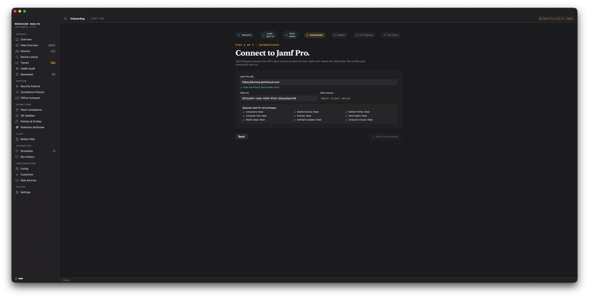

# App Onboarding

The macOS app has a guided first-run flow that takes you from a blank Mac to a first
report. This page walks through it and the workspace it creates.

## Reaching onboarding

On first launch the app opens a **Welcome chooser** with three cards:

- **Connect Jamf Pro** — starts the Jamf Pro onboarding flow.
- **Connect Jamf School** — starts a Jamf School-only onboarding flow (see
  [Jamf School](https://github.com/tonyyo11/jamf-reports-community/wiki/08-Jamf-School)): the
  same wizard, minus the Jamf Pro Authenticate / Validate / Add-products steps, with a
  dedicated **Connect School** step instead. No Jamf Pro placeholder credentials required.
- **Try the demo first** — loads the fictional "Meridian Health" tenant so you can explore
  every screen before connecting anything. Demo mode is not a real workspace; switch back
  to a real connection anytime from **Settings → jamf-cli → Demo mode**.

After the initial choice the chooser does not reappear. To set up additional tenants
later, open the **workspace switcher** at the bottom of the sidebar and choose **Add
workspace…**, or click **Settings → jamf-cli → Connections → Add connection**. Both
routes start the same onboarding flow.

## The onboarding flow

1. **Welcome** — a short intro to what onboarding will do.
2. **Install CLI** — the app checks that `jamf-cli` is installed and on `PATH`, and shows
   the `brew install Jamf-Concepts/tap/jamf-cli` command if it is not. See
   [Installation](https://github.com/tonyyo11/jamf-reports-community/wiki/01-Installation) for details.
3. **Workspace** — choose a profile name. The name becomes a folder under
   `~/Jamf-Reports/<profile>/` and must match `^[a-z0-9][a-z0-9._-]*$` — lowercase, no
   spaces. Pick something short like `prod`. `~/Jamf-Reports` is the default location,
   not a fixed one — **Settings → Workspace location** can point it at a shared team
   folder so several Macs build one pooled history; see
   [Security & Operational Considerations](https://github.com/tonyyo11/jamf-reports-community/wiki/10-Security-and-Operational-Considerations)
   before you do, because everyone with access to that folder can read raw device data.
4. **Authenticate** — connect Jamf Pro with either OAuth2 API client credentials (URL,
   client ID, client secret) or a Platform Gateway tenant ID. The secret is passed to
   `jamf-cli` over a controlling TTY and cleared immediately; the app never persists it.
   `jamf-cli` stores the resulting token in the macOS keychain.
5. **Validate** — the app runs `jamf-cli config validate` against the new profile and
   reports success or a redacted error.
6. **CSV mapping** — optionally pick a Jamf Pro CSV export. The app scaffolds a
   `config.yaml` with best-guess column mappings from the export's headers. You can also
   **Skip for now** — the app writes a minimal config and works from `jamf-cli` data
   alone (see [Running without a CSV](#running-without-a-csv)).
7. **Add products (optional)** — if you use Jamf Protect or Jamf School, connect them here
   (`protect setup` / `school setup`); they augment the Jamf Pro reports. You can also add
   them later from the **Data Sources** screen. (A Jamf School-*only* district should instead
   pick **Connect Jamf School** on the Welcome chooser, which runs the dedicated School path
   below — no Jamf Pro placeholder credentials.)
8. **First report** — the app generates a first report so the dashboards have data to
   render. If the output looks off you can **Skip & finish setup** — the workspace is
   fully configured at this point and you can run reports later from the Reports tab.

### The Jamf School path

Choosing **Connect Jamf School** on the Welcome chooser runs a shorter sequence — Welcome,
Install CLI, Workspace, CSV mapping, **Connect School**, First report — skipping the Jamf
Pro Authenticate, Validate, and Add-products steps. The Connect School step registers a
`jamf-cli school` profile (School URL + Network ID + API key, passed over stdin and cleared)
and wires `school_cli.enabled`/`profile` into the workspace config, so the first report and
every later collect route to the Jamf School engine. jamf-cli must still be installed to get
past the Install CLI step, but no Jamf Pro credentials are entered. Jamf School support ships
community-validated — the maintainer has no Jamf School tenant to test against, so please
[open an issue or pull request](https://github.com/tonyyo11/jamf-reports-community/issues) if
something looks off. See
[Jamf School](https://github.com/tonyyo11/jamf-reports-community/wiki/08-Jamf-School) for the
full workflow.



## Where data lives

Each profile is a self-contained workspace under `~/Jamf-Reports/<profile>/` — or under
whatever folder **Settings → Workspace location** points at, if you have moved it:

```text
~/Jamf-Reports/<profile>/
├── config.yaml          # column mappings, thresholds, scoring weights
├── jamf-cli-data/        # cached JSON snapshots from jamf-cli
├── snapshots/
│   └── computers/
│       ├── csv/          # archived CSV snapshots (optional)
│       └── summaries/    # summary.json per run — feeds the Trends screen
├── Generated Reports/    # produced .xlsx / .html / .pdf artifacts
├── automation/
│   └── logs/             # per-run logs from scheduled runs
└── archive/              # rotated older runs
```

Everything for one tenant is under one folder. To move a profile to another Mac, copy the
folder and re-authenticate with `jamf-cli pro setup` for that profile. Changing the
workspace location does **not** move existing data — copy `config.yaml` and `snapshots/`
across yourself; Run check on the Config screen says when more history for a profile is
sitting in the folder you left behind.

## First-run checklist

A quick tick-list for a fresh install:

- [ ] macOS 14 or later
- [ ] `jamf-cli` installed (`brew install Jamf-Concepts/tap/jamf-cli`)
- [ ] Jamf Pro URL, API client ID, and secret on hand
- [ ] `JamfReports.app` in `/Applications`, first launch past Gatekeeper
- [ ] Profile created through **Add workspace…** → onboarding
- [ ] Authentication succeeded (Validate step passed)
- [ ] First report generated and opened cleanly
- [ ] `~/Jamf-Reports/<profile>/jamf-cli-data/` contains JSON files

## Running without a CSV

A Jamf Pro CSV export is **optional**. With `jamf-cli` data alone the app renders Fleet
Overview, Security Posture, Compliance Posture, Patch Compliance, OS Updates, Policies &
Profiles, Extension Attributes, Mobile Fleet, and more — enough for every report
template.

A CSV export adds the sheets that depend on per-device export columns: Stale Devices,
per-device Security Controls, the Security Agents matrix, per-device compliance
failure lists, and custom Extension Attribute sheets. If your tenant has not configured
those EAs in Jamf Pro, a CSV cannot add them either. Drop a CSV in any time from the
**Data Sources** screen and regenerate.

## Running without jamf-cli credentials

Real Jamf Pro credentials are not required to get through onboarding. `jamf-cli` itself
must be **installed** — the Install CLI step won't let you continue until the app detects
it on `PATH` — but installing it is a free Homebrew download that needs no Jamf Pro
server access.

The Authenticate step only checks that the fields are well-formed (a URL plus a client ID
and secret); it does not contact your Jamf Pro server, and registering the profile is a
local `jamf-cli` config write. The Validate step that follows runs a real connection
check and will report failure against placeholder values — but advancing past it only
requires that the profile registered, not that the check passed. So a CSV-only admin can
complete onboarding with placeholder Jamf Pro values and map a CSV at the CSV-mapping step.
(A Jamf School-only admin can skip this placeholder workaround entirely by choosing
**Connect Jamf School** on the Welcome chooser; the older route — placeholder Jamf Pro
values, then connect Jamf School at **Add products** — still works for existing installs.)

To add real credentials later, open **Data Sources → Connection health → Update
credentials…** — it re-registers the profile's jamf-cli credentials (URL, client ID,
and secret) and runs the same connection check onboarding does, without leaving the app.
The same button also appears when the connection-health probe reports an unauthorized or
credentials-unresolved profile. As a Terminal alternative, run this for the same profile
name:

```bash
jamf-cli pro setup --url https://your-instance.jamfcloud.com
```

This only writes to jamf-cli's own credential store — the app's `config.yaml` and the
rest of the workspace are untouched, so nothing else needs to be redone.

## Next

- [Dashboards](https://github.com/tonyyo11/jamf-reports-community/wiki/03-App-Dashboards) — a tour of every screen.
- [Configuration & Templates](https://github.com/tonyyo11/jamf-reports-community/wiki/04-Configuration-and-Templates) — tune `config.yaml`.
