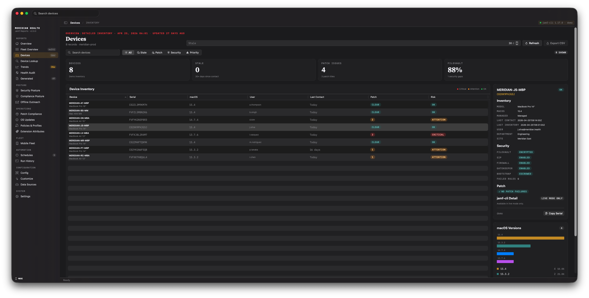
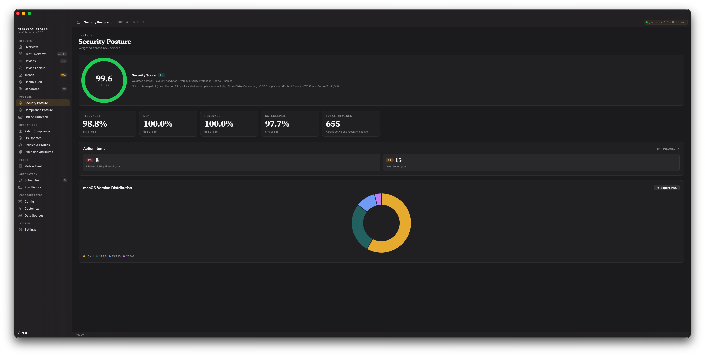
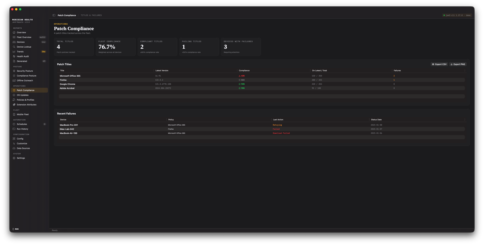
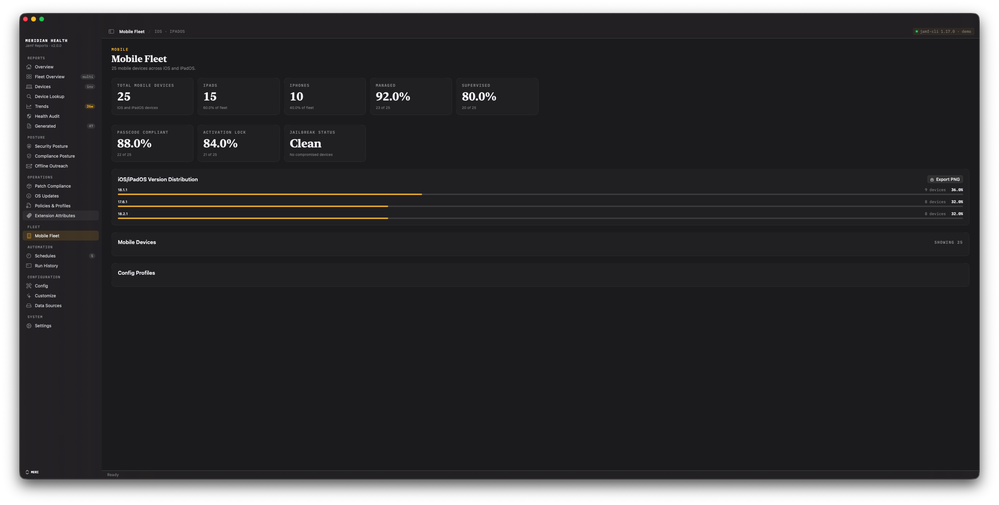

# Dashboards

The app organizes its screens into sidebar groups. This page is a tour of each group.
Every non-core screen can be hidden from **Settings → Sidebar Visibility**; the core
screens (Overview, Devices, Data Sources, Settings) cannot be hidden.

Most dashboards read cached `jamf-cli` snapshots already on disk — opening a dashboard
does not issue new API calls. Data is refreshed by collection (see
[Scheduling & Automation](05-Scheduling-and-Automation)).

## Reports

- **Overview** — the fleet home screen: headline KPIs, an OS-distribution donut, top
  failing compliance rules, security-agent coverage, and recent activity. On a
  macOS 27+ host with AI insights enabled, an AI Fleet Insight card turns the same daily
  digest into a plain-language summary — see [AI Insights](03b-AI-Insights). A banner
  also surfaces when a scheduled run should have fired but didn't — see
  [Automation Trust](05b-Automation-Trust).
  Data source: daily summary digest (tier 3) — see [Data Provenance](11-Data-Provenance).
- **Fleet Overview** — a multi-profile roll-up: one card per workspace with per-profile
  health signals, so MSPs and teams can scan every tenant at once.
  Data source: daily summary digest (tier 3) aggregated across profiles.
- **Devices** — the device inventory table with search, sort, and a Priority Action
  filter. The detail panel shows a per-device risk breakdown. Freshness chips show the
  age of each underlying data source (a red "never" chip flags a kind that's never been
  collected), and a "Collect now" banner appears when the cache is stale.
  Data source: per-device snapshots of computers and mobile-device inventory (tier 1).
- **Device Lookup** — find one device by serial, hostname, asset tag, or ID.
  Data source: per-device snapshot of computer detail from `pro device <id>` (tier 1).
- **Trends** — historical charts over archived snapshots. See
  [Historical Trends](06-Historical-Trends).
  Data source: daily summary digest (tier 3) over time; see Data Provenance for metric
  definitions.
- **Health Audit** — instance health findings plus computer-group hygiene (empty and
  unused smart/static groups).
  Data source: `pro audit` (instance-config checks, fetched by the Run Audit button)
  and group lists (tier 1).
- **Generated** — the library of reports already produced, with actions to generate new
  workbooks, HTML reports, and inventory CSVs.
  Data source: generated report catalog (no single tier; see [Data Provenance](11-Data-Provenance) for report composition).

## Posture

- **Security Posture** — a weighted Security Score ring, per-control KPIs (FileVault,
  SIP, firewall, Gatekeeper), prioritized action items, and an OS-version donut.
  Freshness chips show the age of the underlying data source.
  Data source: `pro report security` (tier 2) aggregates and device inventory (tier 1).
- **Compliance Posture** — a compliance-band distribution donut (Pass / Low / Med-Low /
  Medium / High / No Data), control-coverage gaps, and a per-OS breakdown. When
  `compliance.baselines` configures more than one mSCP/STIG baseline (for example, one per
  OS or one per framework), each baseline gets its own donut; a device whose failure count
  exceeds that baseline's configured rule count is treated as No Data rather than a real
  High band. [Historical Trends](06-Historical-Trends) gains a matching baseline picker on
  its compliance-band chart once more than one baseline is configured.
  Data source: per-device EA results for mSCP/STIG baselines (tier 1) and device inventory
  (tier 1).
- **Compliance Benchmarks** — per-benchmark compliance rates and device counts from the
  Jamf Platform API. Experimental; requires `platform.enabled: true`,
  `experimental.platform_features_enabled: true`, and a platform-auth jamf-cli profile.
  Shows a locked state when the Platform API gate is closed.
  Data source: Jamf Platform API `compliance-devices` (tier 1) and device inventory (tier
  1).
- **Offline Outreach** — stale devices bucketed into outreach tiers (31–90 / 91–180 /
  180+ days) with a one-click clipboard mail-merge of the affected users.
  Data source: per-device last-check-in dates from device-compliance (tier 1) and device
  inventory (tier 1).

## Operations

- **Patch Compliance** — per-title patch compliance with a failures drawer; a "Days
  Behind" column and a Patch Velocity card chart how quickly titles reach adoption once
  released — see [Patch Velocity](06b-Patch-Velocity). Freshness chips show the age of
  the underlying data. Exports to CSV and PNG.
  Data source: `pro report patch-status` per-title (tier 2); per-device failures from
  `--scan-failures` (tier 1); title release dates from `pro patch-software-title-configurations
  definitions` (tier 2).
- **OS Updates** — managed software-update plan state, failed plans, and devices in an
  error state. Freshness chips show the age of the underlying data sources.
  Data source: `pro report update-status` plan summaries (tier 2); per-device failures
  from `--scan-failures` (tier 1).
- **DDM Blueprints** — Declarative Device Management blueprint deployment status and
  declaration details from the Jamf Platform API. Experimental; requires the same three
  Platform API gates as Compliance Benchmarks above. Shows a locked state when the gate
  is closed.
  Data source: Jamf Platform API blueprint definitions and device assignments (tier 2).
- **Policies & Profiles** — a two-tab screen: policy configuration findings, and
  configuration-profile deployment status.
  Data source: `pro report policy-status` (tier 2) and `pro report profile-status` (tier
  2).
- **Extension Attributes** — a neutral per-EA browser: how many devices report each EA
  (not a coverage percentage — EAs are custom and often legitimately sparse, so the
  screen never grades them against 100%) and top-value distributions. A drift callout
  flags EAs whose device count dropped sharply since the previous collect, comparing an
  EA against its own prior value rather than an absolute target.
  Data source: per-device EA results (tier 1) and device inventory (tier 1).

## Fleet

- **Mobile Fleet** — iOS/iPadOS device counts, compliance signals, OS-version
  distribution, and a device/profile inventory.
  Data source: per-device mobile device inventory (tier 1) and profiles (tier 2).
- **Jamf Protect** — Protect alerts, agent health, and insights. Shows an explicit
  "Protect not detected" state for tenants that do not run Jamf Protect.
  Data source: Jamf Protect GraphQL API (separate OAuth2 credentials, tier 2).
- **Groups & Searches** — computer and mobile-device group inventory (smart vs. static),
  plus advanced mobile-device searches.
  Data source: Classic API computer/mobile-device group lists (tier 1, same as the group
  lists in Health Audit above) and advanced mobile-device searches.

## Automation

- **Schedules** — when the managed automation policy is on, this tab is the Automation
  screen: a single policy toggle that installs or removes LaunchAgent jobs for
  unattended collection and reporting, an Automation Health section (overdue/failing
  schedules), a Notifications section (Teams/Slack webhook configuration), and
  report-group management for consolidated multi-profile reports. When managed
  automation is off, it's the manual schedule editor instead. See
  [Scheduling & Automation](05-Scheduling-and-Automation) and
  [Automation Trust](05b-Automation-Trust).
  Data source: no tier (configuration and schedule management).
- **Run History** — streamed output from past collect and generate runs, including an
  "Explain this run" AI action on failed runs — see [AI Insights](03b-AI-Insights).
  Data source: no tier (local log files, not API data).

## Configuration

- **Config** — the `config.yaml` editor. See
  [Configuration & Templates](04-Configuration-and-Templates).
  Data source: no tier (configuration only).
- **Customize** — choose which sheets a generated workbook includes and which metrics the
  Overview score cards show.
  Data source: no tier (user preferences).
- **Data Sources** — the inputs surface: cached `jamf-cli` data, the CSV inbox, and
  snapshot status.
  Data source: no tier (local workspace cache status).
- **Backups** — snapshot and compare Jamf Pro configuration backups.
  Data source: `jamf-cli pro backup` exports (tier 2).

## System

- **Settings** — app preferences: the jamf-cli install/update check, connections, the
  collection-cadence preset, diagnostics, and Sidebar Visibility.
  Data source: no tier (app configuration).
