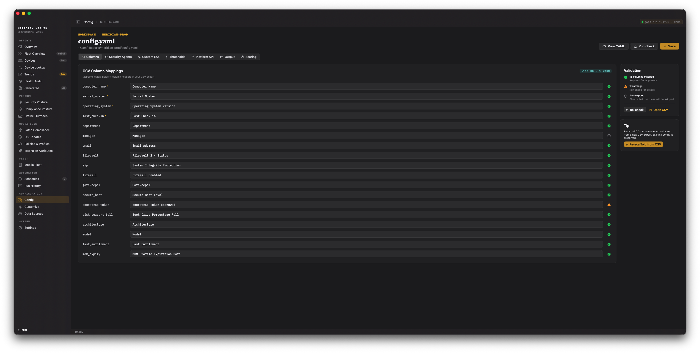

# Configuration & Templates

`config.yaml` is the bridge between your Jamf data shape and the report logic. It maps
your tenant's column and Extension Attribute names to the logical fields the reports
expect. One `config.yaml` lives in each profile workspace.

The complete, annotated schema is the repo's
[`config.example.yaml`](https://github.com/tonyyo11/jamf-reports-community/blob/main/config.example.yaml).
Treat that file as the reference — the engine ignores unknown keys, so do not invent new
ones.

## How config.yaml is created

- **During onboarding** — the CSV-mapping step scaffolds a `config.yaml` with best-guess
  column mappings from a Jamf Pro CSV export (or a minimal config if you skip).

Scaffolding is a starting point, not a final answer. Always review the result.

## The Config screen



In the app, the **Config** screen edits `config.yaml` through seven tabs:

| Tab | What it covers |
|---|---|
| Columns | CSV column → logical field mappings |
| Security Agents | third-party agents to track (CrowdStrike, etc.) |
| Custom EAs | extra Extension-Attribute-driven sheets |
| Thresholds | stale-device days, disk-usage and compliance bands |
| Platform API | opt-in Jamf Platform API reporting |
| Output & Branding | output directory, archiving, run retention, report branding |
| Scoring | the weighted Security Score and risk-score weights |

## Reviewing column mappings

Scaffolding fuzzy-matches headers; check these common mistakes:

- `manager` must be a real manager field, not Jamf's `Managed` status column.
- `secure_boot` must map to the Secure Boot column.
- `bootstrap_token` should map to the escrowed state.
- `disk_percent_full` must be a percentage column, not free space in MB.

Field names are exact and case-sensitive — `operating_system` (not `os_version`),
`last_checkin` (not `last_contact`), `email` (not `assigned_user_email`). The
[`config.example.yaml`](https://github.com/tonyyo11/jamf-reports-community/blob/main/config.example.yaml)
header comments list every field.

## Tracked sections

Not every config block has a screen in the app. The Config screen's seven tabs cover
`columns`, `security_agents`, `custom_eas`, `thresholds`, `platform`, `output`, and
`scoring`. `notify` and `ai` each have their own dedicated panel elsewhere in the app
(linked below). `alerts`, `retention`, and `compliance.baselines` are hand-edited in
`config.yaml` directly — there is no editor for them in the app yet, and so are
`shared_workspace` and the two `charts` sub-keys the Customize screen does not cover.

Hand-editing is safe alongside the GUI: the app's config editor only rewrites its own
managed keys and preserves everything else verbatim, and scheduled runs read
`config.yaml` fresh at each run — an edit to `alerts:` or `notify:` takes effect on the
next scheduled run, no relaunch required.

- **`security_agents`** — a list of third-party agents. Each entry drives a row in the
  Security Agents sheet. `connected_value` is a case-insensitive substring match.
- **`sheets`** — optional `only` / `skip` lists to trim the workbook by tab name.
- **`thresholds`**, **`output`**, **`charts`** — stale-device window, disk-usage bands,
  output retention, chart toggles.

### Compliance baselines (`compliance`)

`compliance.failures_count_column` and `compliance.failures_list_column` are the
single-baseline shorthand: an EA column carrying the integer failed-rule count, and an
optional pipe-delimited EA column carrying the failed rule IDs, for mSCP/STIG
reporting.

For more than one baseline (an enforced baseline and an audit baseline, or separate
baselines per department), use `compliance.baselines` — a list of
`{name, failures_count_column, failures_list_column, rule_count}` entries. Each
baseline gets its own compliance-band donut and its own Trends band series (see
[Historical Trends](https://github.com/tonyyo11/jamf-reports-community/wiki/06-Historical-Trends)); a baseline picker appears once more than
one is configured. `rule_count`, when set, bounds validity: a failure count above the
baseline's total rule count is treated as bad data (No Data), not banded as a High
failure count. When `baselines` is empty, the app synthesizes a single baseline from
`failures_count_column` + `baseline_label`.

### Shared workspaces (`shared_workspace`)

Only relevant when several Macs point at the same workspace folder. It lives in
`config.yaml` — rather than in this Mac's preferences, where the workspace *location*
lives — because every machine sharing the folder has to agree on it:

```yaml
shared_workspace:
  enabled: true                  # omit to decide from the folder itself
  claim_ttl_minutes: 45          # how long a run's claim stays valid (5-720)
  min_collect_interval_hours: 12 # 0 disables the freshness check (max 168)
```

- **`enabled`** is three-state. Leave it out and coordination turns itself on when the
  workspace resolves to a synced folder. Set it explicitly to force it on for a share the
  provider detection does not recognise, or off for a local folder that merely happens to
  sit under a synced path.
- **`claim_ttl_minutes`** (default 45) is how long a run's advertised claim stays valid.
  Floored at 5 minutes so a typo cannot produce a lease that expires before the collect it
  covers, and capped at 720 (12 hours) so a machine that crashed mid-run cannot hold the
  folder for a week.
- **`min_collect_interval_hours`** (default 12) is the window inside which another Mac's
  collect makes this one stand down. `0` disables the check, which is a reasonable choice
  when the machines cover different tenants. Capped at 168 (a week), because one mistyped
  digit in a *shared* file would otherwise stand every Mac down for days with no failure
  to see — only an absence of runs.

Pressing **Refresh** in the app always collects regardless of the freshness window. See
[Security & Operational Considerations](https://github.com/tonyyo11/jamf-reports-community/wiki/10-Security-and-Operational-Considerations)
for the full picture, including what a shared folder costs you in readable device data.

### Metric alerts (`alerts`)

Opt-in threshold alerting, off by default. Each rule in `alerts.rules` names a metric
(`filevault_pct`, `patch_pct`, `stale_count`, and similar daily-summary fields), a
comparison (`below`, `above`, or `drops_more_than`), a `threshold`, and — for
`drops_more_than` only — a `lookback_days` (default 7). Rules are evaluated only on
scheduled runs that actually collect fresh data (a `jamf-cli-only` schedule generates
from cache and never evaluates alerts). When a rule trips, one attention card posts to
the `notify` webhook below; a rule with no data that day never fires. A rule with an
unknown metric, an unknown comparison, or a missing/invalid threshold is dropped
rather than breaking the whole config, and shows up as a warning in the Health Audit
screen's Config Doctor. `alerts` has no in-app editor — edit `config.yaml` directly.

### Webhook notifications (`notify`)

Opt-in scheduled-run digest to a Microsoft Teams or Slack incoming webhook:
`enabled`, `provider` (`teams` | `slack`), `url` (must be `https://`), and `detail`
(`full` sends metric values and schedule names; `minimal` sends event facts only —
counts and statuses, no values or free text — for headless or high-security
deployments). Unlike `alerts`/`retention`, `notify` has an in-app editor: the
Automation screen's Notifications section (enable toggle, provider picker, URL field,
detail level, and a "Send test notification" button). See
[Automation Trust](https://github.com/tonyyo11/jamf-reports-community/wiki/05b-Automation-Trust).

### Snapshot retention (`retention`)

Off by default — raw `jamf-cli-data/` snapshots are kept indefinitely, since they are
a reporting input (day-over-day and week-over-week history), not just disk cost. When
`enabled: true`: `mode` is `archive` (moves old snapshots to `archive_dir`, still on
disk) or `delete`; `snapshot_keep_days` (default 365, `<= 0` disables the age rule) and
`snapshot_keep_count` (default 0, a floor on newest-N files per kind) both protect a
file — either one keeps it; `include_summaries` (default false) leaves the durable
trend summaries alone unless explicitly set true; `archive_dir` defaults to
`<workspace>/_archive`. `retention` has no in-app editor.

### AI insights (`ai`)

Opt-in, and inert on any macOS below 27: `enabled`, `tier` (`on_device` |
`external` — `external` is reserved, not yet built), and `reasoning_level`
(`light` | `moderate` | `deep`). Apple Foundation Models is on-device only, so
`on_device` is the default and the only built behaviour.
See [AI Insights](https://github.com/tonyyo11/jamf-reports-community/wiki/03b-AI-Insights) for what the feature does and its in-app Settings
panel.

### jamf-cli cache & integrity (`jamf_cli`)

- **`max_cache_age_hours`** (default 168, one week) — how old a cached snapshot can be
  before the daily summary digest treats it as absent rather than serving it as
  current. `0` (or any value `<= 0`) keeps cache forever. This only affects the daily
  digest path; report sheets still render an older cache with their own "data as of"
  subtitles rather than an empty section.
- **`require_manifest`** — when `true`, every collected snapshot is recorded in a
  per-kind `manifest.json` (SHA-256), and a mismatch or corrupt manifest is surfaced as
  a real finding on the Health Audit screen instead of a neutral "not yet verified"
  line.

## Custom Extension Attribute sheets

`custom_eas` is a list; each entry produces one workbook sheet. Five types:

| Type | Behavior | Key fields |
|---|---|---|
| `boolean` | pass/fail counts | `true_value` |
| `percentage` | color-coded distribution | `warning_threshold`, `critical_threshold` |
| `version` | version distribution | `current_versions` |
| `text` | value frequency table | — |
| `date` | days-until-expiry, color-coded | `warning_days` |

Recipes:

```yaml
custom_eas:
  - name: "FileVault Status"
    column: "FileVault 2 - Status"
    type: boolean
    true_value: "Encrypted"

  # mSCP/STIG failure counts don't belong here — `percentage` is bounded 0-100 and a
  # rule-failure count isn't a percentage. Configure them under `compliance.baselines`
  # instead (see Compliance baselines above) — that's what drives the compliance-band
  # donut and the Trends band series.

  - name: "User Cert Expiry"
    column: "User Certificate - Expiry Date"
    type: date
    warning_days: 30
```

```yaml
security_agents:
  - name: "CrowdStrike Falcon"
    column: "CrowdStrike Falcon - Status"
    connected_value: "Installed"
```

After editing, open the **Health Audit** screen — each Custom EA is listed with its
column name and detected type, and any column missing from the cached data is flagged.

## The Customize screen

The **Customize** screen controls what a generated workbook contains:

- Toggle individual sheets on or off.
- Choose which metrics appear on the Overview score cards.
- Apply a template preset as a starting point.
- Two chart switches, saved per profile when you press Apply:
  **Save PNGs alongside xlsx** (`charts.save_png`) and **Per-major-version charts**
  (`charts.os_adoption.per_major_charts`).

Both chart switches default to on, so a workspace with no `charts:` block behaves as it
always has. `save_png: false` now genuinely stops standalone PNG files being written
beside the workbook — before 2.7.0 the setting was read by nothing and PNGs were always
written. Charts *embedded in* the workbook are governed separately by
`charts.embed_in_xlsx`.

## Checking your config

**Config → Run check** runs every validation the app has — not just "does `config.yaml`
parse". It reports column mappings that no longer match your CSV, baselines pointing at
extension attributes nobody collects, malformed alert rules, data-accuracy problems, and
the state of the workspace folder, each with a concrete fix. On a shared workspace it also
reports the other Macs writing there.

Two of its findings are about a workspace that is fine but not the one you expected: it
says when **more history for this profile exists in another folder** (naming it and how
much is there), and when **a workspace is new**, so column mappings and thresholds are
defaults rather than something you set. Both are suggestions, not failures, and both stay
quiet once the workspace has history.

The same checks run headlessly as `jamf-reports check` — see
[Command Line](https://github.com/tonyyo11/jamf-reports-community/wiki/07-Command-Line).
A scheduled run records any *failing* check in its own log, so a run that collects happily
against broken column mappings no longer looks clean in Run History.

## Report templates

The app ships five report templates. Pick one when generating; each is a curated sheet
selection, not a separate engine. All formats — XLSX, HTML, PDF — are produced by the
native Swift engine.

| Template | Audience | Cadence | Focus |
|---|---|---|---|
| Executive | Leadership | Monthly | One-screen story: managed devices, encryption, patch posture, OS adoption |
| Operational | Fleet ops | Daily | Actionable failures and intervention queues |
| Compliance | Auditors | Monthly | Jamf state tied to mSCP baselines and compliance bands |
| Asset | Asset / lifecycle | Quarterly | Hardware inventory and refresh planning |
| Security Posture | Security review | Weekly | Managed controls, security agents, EA-derived signals |

To change a template's sheet selection permanently, edit its file under
`app/Sources/JamfReports/Engine/Templates/` and rebuild — that is a code change, not a
config change.

## Platform API (opt-in)

As of v2.1.0, three conditions must all be true to enable the Platform API sheets
(blueprint status, DDM status, and benchmark-specific compliance sheets):

1. `platform.enabled: true` in `config.yaml`
2. `experimental.platform_features_enabled: true` in `config.yaml`
3. The active `jamf-cli` profile must be configured with `auth-method: platform`

Setting `platform.enabled: true` alone is no longer sufficient — the experimental gate
and the platform-auth profile are also required. The `capabilities` command reports
whether the gate is open for the current profile.
