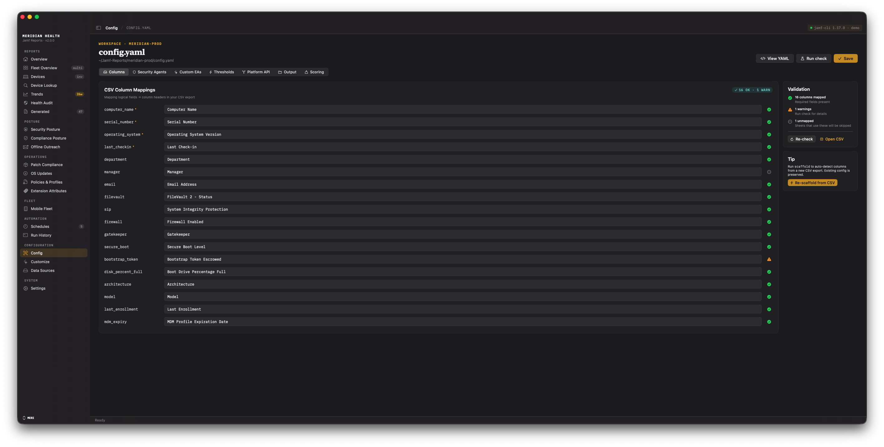

# Configuration & Templates

`config.yaml` is the bridge between your Jamf data shape and the report logic. It maps
your tenant's column and Extension Attribute names to the logical fields the reports
expect. One `config.yaml` lives in each profile workspace.

The complete, annotated schema is the repo's
[`config.example.yaml`](https://github.com/tonyyo11/jamf-reports-community/blob/main/config.example.yaml).
Treat that file as the reference — the engine ignores unknown keys, so do not invent new
ones.

## How config.yaml is created

- **During onboarding** — the CSV-mapping step scaffolds a `config.yaml` with best-guess
  column mappings from a Jamf Pro CSV export (or a minimal config if you skip).

Scaffolding is a starting point, not a final answer. Always review the result.

## The Config screen



In the app, the **Config** screen edits `config.yaml` through eight tabs:

| Tab | What it covers |
|---|---|
| Columns | CSV column → logical field mappings |
| Security Agents | third-party agents to track (CrowdStrike, etc.) |
| Custom EAs | extra Extension-Attribute-driven sheets |
| Thresholds | stale-device days, disk-usage and compliance bands |
| Platform API | opt-in Jamf Platform API reporting |
| Output & Branding | output directory, archiving, run retention, report branding |
| Scoring | the Security Policy card, the weighted Security Score and risk-score weights |
| From config.yaml | read-only: settings no tab edits, keys the app does not read, lines it skipped |

## Reviewing column mappings

Scaffolding fuzzy-matches headers; check these common mistakes:

- `manager` must be a real manager field, not Jamf's `Managed` status column.
- `secure_boot` must map to the Secure Boot column.
- `bootstrap_token` should map to the escrowed state.
- `disk_percent_full` must be a percentage column, not free space in MB.

Field names are exact and case-sensitive — `operating_system` (not `os_version`),
`last_checkin` (not `last_contact`), `email` (not `assigned_user_email`). The
[`config.example.yaml`](https://github.com/tonyyo11/jamf-reports-community/blob/main/config.example.yaml)
header comments list every field.

## Tracked sections

Not every config block has a screen in the app. The Config screen's seven editing tabs
cover `columns`, `security_agents`, `custom_eas`, `thresholds`, `platform`, `output`, and
`scoring`; the eighth, **From config.yaml**, is read-only and lists what none of them
edit. `notify` and `ai` each have their own dedicated panel elsewhere in the app
(linked below). `alerts`, `retention`, and `compliance.baselines` are hand-edited in
`config.yaml` directly — there is no editor for them in the app yet, and so are
`shared_workspace` and the two `charts` sub-keys the Customize screen does not cover.
The From config.yaml tab shows all of these read-only.

Hand-editing is safe alongside the GUI: a save from the Config screen rewrites only the
blocks that screen edits and keeps the rest, and scheduled runs read `config.yaml` fresh
at each run — an edit to `alerts:` or `notify:` takes effect on the next scheduled run,
no relaunch required. Inside a block the screen rewrites, comments and lines the app
could not read are not kept: the app copies the file first, and refuses a save when the
file changed on disk after the screen loaded it. See
[A hand-edited config.yaml](#a-hand-edited-configyaml).

- **`security_agents`** — a list of third-party agents. Each entry drives a row in the
  Security Agents sheet. `connected_value` is a case-insensitive substring match; a value
  that says the agent is absent or off ("Not Installed", "not running", "Disconnected") never
  matches, and a blank `connected_value` counts any non-empty value.
- **`sheets`** — `only`, `skip` and `order`, by tab name (case-insensitive), shape every
  report workbook: the Jamf Pro tabs, the CSV tabs, the Charts tab and Jamf School
  workbooks. The report template picks its sheets first, so `only` never adds a tab; a
  name in both `only` and `skip` is not written; `order` can put a CSV tab ahead of the
  Jamf Pro tabs; a non-empty `only` drops Charts unless you list "Charts"; an `only` that
  names no tab of the workbook is ignored with a warning. An empty `only: []` means no
  restriction. Period and fleet workbooks do not read these.
- **`thresholds`**, **`output`**, **`charts`** — stale-device window, disk-usage bands,
  output retention, chart toggles.

### Compliance baselines (`compliance`)

`compliance.failures_count_column` and `compliance.failures_list_column` are the
single-baseline shorthand: an EA column carrying the integer failed-rule count, and an
optional EA column carrying the failed rule IDs, for mSCP/STIG reporting. The IDs are
one per line; a comma, semicolon or pipe also separates them, and a status in place of
a list ("No Baseline Set", "Multiple Baselines Found") marks a Mac that was not
evaluated.

For more than one baseline (an enforced baseline and an audit baseline, or separate
baselines per department), use `compliance.baselines` — a list of
`{name, failures_count_column, failures_list_column, rule_count}` entries. Each
baseline gets its own compliance-band donut and its own Trends band series (see
[Historical Trends](https://github.com/tonyyo11/jamf-reports-community/wiki/06-Historical-Trends)); a baseline picker appears once more than
one is configured. `rule_count`, when set, bounds validity: a failure count above the
baseline's total rule count is treated as bad data (No Data), not banded as a High
failure count. When `baselines` is empty, the app synthesizes a single baseline from
`failures_count_column` + `baseline_label`.

### Security policy (`security_policy`)

By default every security control counts as a gap when it is off. The `security_policy`
block changes that for one workspace, on every screen, report and scheduled run. Each
control, `filevault`, `sip`, `firewall` and `gatekeeper`, is `fail` (a gap: it counts in
the action items, the per-device gap count, risk points and the score, and shows red),
`warning` (shown amber, not a gap, scored as compliant) or `ignore` (not counted at all,
and its score weight is dropped). The percentages themselves, such as FileVault on 94%,
never change; only what the app calls a gap does. You can set it on the **Scoring** tab's
Security Policy card, which saves each change to config.yaml at once and keeps the rest of
the file, or write it by hand:

```yaml
security_policy:
  controls:
    filevault: fail      # fail | warning | ignore
    sip: fail
    firewall: fail
    gatekeeper: fail
  filevault_off_hardware_encrypted: warning
  on_values:             # optional: your own words for on, per control
    firewall: ["Pass", "Compliant"]
  off_values:            # optional: your own words for off, per control
    firewall: ["Fail", "Non-Compliant"]
  score_weights:         # 0-100 each; omit for the defaults
    filevault: 15
```

**Hardware-encrypted Macs.** An Apple silicon Mac, or an Intel Mac with a T2 chip, always
encrypts its internal disk; with FileVault off the disk simply unlocks without a password.
`filevault_off_hardware_encrypted` sets the level for that case alone (`Same as FileVault`
on the card). Those Macs are named "FileVault off (hardware-encrypted)" and counted apart.
The rule needs the Mac's model details from the latest inventory collect; a Mac whose
record is missing, ambiguous (two records on one serial number) or a virtual machine keeps
FileVault's own level. On a CSV, map `architecture` ("Architecture Type") and
`model_identifier` ("Model Identifier"); `model` is the marketing name ("Model") and does not
identify a T2 Mac. Config Doctor warns when the rule is set, a CSV is present and either
key is unmapped.

**Macs that did not report a control.** A Mac whose value Jamf did not collect for a control
(`NOT_COLLECTED`, a blank, FileVault still encrypting) is not counted as failing it. The Security
Posture, Compliance Posture and Executive Summary figures, the score, the HTML report and the
daily summary count only the Macs measured off, leave the unreported ones out of that control's
share, and say how many there were ("not reported: N", shown only when N is above zero). The
percentages themselves, such as SIP on 1%, still count every Mac.

**Your own on and off values.** The app reads values such as `Enabled`, `Encrypted`, `Off`
and `Not Enabled`. When your organization maps its own extension attribute or CSV column to
a control and it says something else, such as `Pass` and `Fail` or `Compliant` and
`Non-Compliant`, the app cannot tell whether a Mac passes and counts it as not measured.
List your words under `on_values` and `off_values`, per control (`filevault`, `sip`,
`firewall`, `gatekeeper`), as a list or a single string, and every screen and report reads
them. A value must match whole, in any case, with `-` and `_` read as spaces, so
`Non-Compliant` is not read as `Compliant`. `off_values` is checked first, then `on_values`,
then the built-in words; a value in both lists reads as off. These words apply to each
Mac's own value. The totals that jamf-cli's security report carries (the counts on the
Security Posture screen) keep jamf-cli's words. Config → Run check warns about a value that
is not text, an empty value, and a value listed in both.

**Score weights.** Weights are saved in the workspace (`score_weights`), so the Security
Posture screen, the Overview, Trends, alerts and reports all score the same way. Weights
set on this Mac before 2.9 show on the Scoring tab and apply to a workspace once you
change one. A policy or weight change shows in the daily summary, and so on the Overview
and Trends, from the next day's first collect.

A level written as `warn`, `failure`, `gap`, `ignored`, `skip` or `not counted` is read,
in any case. A value the app cannot read leaves that control at `fail` (the hardware rule
at FileVault's level); the Scoring card and Config → Run check name it and the level used
instead.

### Shared workspaces (`shared_workspace`)

Only relevant when several Macs point at the same workspace folder. It lives in
`config.yaml` — rather than in this Mac's preferences, where the workspace *location*
lives — because every machine sharing the folder has to agree on it:

```yaml
shared_workspace:
  enabled: true                  # omit to decide from the folder itself
  claim_ttl_minutes: 45          # how long a run's claim stays valid (5-720)
  min_collect_interval_hours: 12 # 0 disables the freshness check (max 168)
```

- **`enabled`** is three-state. Leave it out and coordination turns itself on when the
  workspace resolves to a synced folder. Set it explicitly to force it on for a share the
  provider detection does not recognise, or off for a local folder that merely happens to
  sit under a synced path.
- **`claim_ttl_minutes`** (default 45) is how long a run's advertised claim stays valid.
  Floored at 5 minutes so a typo cannot produce a lease that expires before the collect it
  covers, and capped at 720 (12 hours) so a machine that crashed mid-run cannot hold the
  folder for a week.
- **`min_collect_interval_hours`** (default 12) is the window inside which another Mac's
  collect makes this one stand down. `0` disables the check, which is a reasonable choice
  when the machines cover different tenants. Capped at 168 (a week), because one mistyped
  digit in a *shared* file would otherwise stand every Mac down for days with no failure
  to see — only an absence of runs.

Pressing **Refresh** in the app always collects regardless of the freshness window. See
[Security & Operational Considerations](https://github.com/tonyyo11/jamf-reports-community/wiki/10-Security-and-Operational-Considerations)
for the full picture, including what a shared folder costs you in readable device data.

### Metric alerts (`alerts`)

Opt-in threshold alerting, off by default. Each rule in `alerts.rules` names a metric
(`filevault_pct`, `patch_pct`, `stale_count`, and similar daily-summary fields), a
comparison (`below`, `above`, or `drops_more_than`), a `threshold`, and — for
`drops_more_than` only — a `lookback_days` (default 7). Rules are evaluated only on
scheduled runs that actually collect fresh data (a `jamf-cli-only` schedule generates
from cache and never evaluates alerts). When a rule trips, one attention card posts to
the `notify` webhook below; a rule with no data that day never fires. A rule with an
unknown metric, an unknown comparison, or a missing/invalid threshold is dropped
rather than breaking the whole config, and shows up as a warning in the Health Audit
screen's Config Doctor. `alerts` has no in-app editor — edit `config.yaml` directly.

### Webhook notifications (`notify`)

Opt-in scheduled-run digest to a Microsoft Teams or Slack incoming webhook:
`enabled`, `provider` (`teams` | `slack`), `url` (must be `https://`), and `detail`
(`full` sends metric values and schedule names; `minimal` sends event facts only —
counts and statuses, no values or free text — for headless or high-security
deployments). Unlike `alerts`/`retention`, `notify` has an in-app editor: the
Automation screen's Notifications section (enable toggle, provider picker, URL field,
detail level, and a "Send test notification" button). See
[Automation Trust](https://github.com/tonyyo11/jamf-reports-community/wiki/05b-Automation-Trust).

### Snapshot retention (`retention`)

Off by default — raw `jamf-cli-data/` snapshots are kept indefinitely, since they are
a reporting input (day-over-day and week-over-week history), not just disk cost. When
`enabled: true`: `mode` is `archive` (moves old snapshots to `archive_dir`, still on
disk) or `delete`; `snapshot_keep_days` (default 365, `<= 0` disables the age rule) and
`snapshot_keep_count` (default 0, a floor on newest-N files per kind) both protect a
file — either one keeps it; `include_summaries` (default false) leaves the durable
trend summaries alone unless explicitly set true; `archive_dir` defaults to
`<workspace>/_archive`. `retention` has no in-app editor.

### Where reports go (`output`, `branding`)

Reports are written to `output.output_dir`, with `~` expanded. A folder outside the
workspace is used only with `output.allow_absolute_paths: true` (`yes`, `on` and `1` also
work; write `true`). A folder the app will not use — outside the workspace without that
setting, or a system or credentials folder — is named in the run log with the reason, and
the report goes to `Generated Reports` in the workspace. The Reports screen lists the
folder in use (and its archive), its header names it, and Reveal in Finder, Open and the
save panels start there. `retention.archive_dir` follows the same rule. `output.keep_latest_runs` below 1 is read as 1. `branding.accent_color`
takes `#RRGGBB` or `#RGB`; anything else uses the default.

### AI insights (`ai`)

Opt-in, and inert on any macOS below 27: `enabled`, `tier` (`on_device`, the
only one), and `reasoning_level`
(`light` | `moderate` | `deep`). Apple Foundation Models is on-device only, so
`on_device` is the default and the only built behaviour.
See [AI Insights](https://github.com/tonyyo11/jamf-reports-community/wiki/03b-AI-Insights) for what the feature does and its in-app Settings
panel.

### jamf-cli collection, cache & integrity (`jamf_cli`)

- **`collect_skip`** (default empty) — report types a collect never runs, a stall guard
  for on-premise Jamf Pro: any of `patch-device-failures`, `profile-status`,
  `update-status` and `update-device-failures`, the per-device-heavy queries known to
  stall a server (underscores work in place of hyphens). Anything else in the list is
  ignored, so core inventory always runs. A listed source is skipped even by a manual
  collect, the run log says so, and the data freshness strip does not wait for it.
- **`max_cache_age_hours`** (default 168, one week) — how old a cached snapshot can be
  before the daily summary digest treats it as absent rather than serving it as
  current. `0` (or any value `<= 0`) keeps cache forever. This only affects the daily
  digest path; report sheets still render an older cache with their own "data as of"
  subtitles rather than an empty section.
- **`require_manifest`** — when `true`, every collected snapshot is recorded in a
  per-kind `manifest.json` (SHA-256), and a mismatch or corrupt manifest is surfaced as
  a real finding on the Health Audit screen instead of a neutral "not yet verified"
  line.

## Custom Extension Attribute sheets

`custom_eas` is a list; each entry produces one workbook sheet. Five types:

| Type | Behavior | Key fields |
|---|---|---|
| `boolean` | pass/fail counts | `true_value` |
| `percentage` | color-coded distribution | `warning_threshold`, `critical_threshold` |
| `version` | version distribution | `current_versions` |
| `text` | value frequency table | — |
| `date` | days-until-expiry, color-coded | `warning_days` |

Recipes:

```yaml
custom_eas:
  - name: "FileVault Status"
    column: "FileVault 2 - Status"
    type: boolean
    true_value: "Encrypted"

  # mSCP/STIG failure counts don't belong here — `percentage` is bounded 0-100 and a
  # rule-failure count isn't a percentage. Configure them under `compliance.baselines`
  # instead (see Compliance baselines above) — that's what drives the compliance-band
  # donut and the Trends band series.

  - name: "User Cert Expiry"
    column: "User Certificate - Expiry Date"
    type: date
    warning_days: 30
```

```yaml
security_agents:
  - name: "CrowdStrike Falcon"
    column: "CrowdStrike Falcon - Status"
    connected_value: "Installed"
```

After editing, open the **Health Audit** screen — each Custom EA is listed with its
column name and detected type, and any column missing from the cached data is flagged.

## The Customize screen

The **Customize** screen holds the report options that are not in Config:

- Two chart switches, saved per profile when you press Apply:
  **Save PNGs alongside xlsx** (`charts.save_png`) and **Per-major-version charts**
  (`charts.os_adoption.per_major_charts`).
- **Write the HTML report with every workbook** (`html.with_workbook`, saved with Apply
  too): when on, each run that writes a profile's workbook also writes that profile's HTML
  report beside it, with the same name and a `.html` extension and the same template's
  sections. It covers the Generate buttons, scheduled runs that generate, and
  `jamf-reports generate`. It does not cover the fleet and period workbooks, or Jamf
  School workbooks, which have no HTML report. Choosing HTML as a format in **Generate…**
  writes that one HTML report, not a second. If the HTML report cannot be written, the
  workbook is kept and the run log gets one `[warn] HTML report not written` line; the run
  is not marked Partial. When older runs are archived (`output.keep_latest_runs`), a
  workbook's HTML report moves to the archive with it and does not count as a run of its own;
  an HTML report with no workbook of the same name, such as the one **Generate…** writes
  when you choose HTML as a format, or `jamf-reports html` output, stays where it is. It is
  off by default.
- A button to the Overview's own **Customize** sheet, where you choose which score cards and
  sections the Overview shows.
- How to get a shorter workbook: choose a template or your own sheets with **Generate…** on
  Generated Reports, or use the command-line tool's `--template` (see Report templates
  below).

Before 2.8.1 the screen also had a grid of sheet toggles, an Executive preset and three more
chart switches. Nothing saved them or read them when generating, so they are gone. The
stale-device trend (`charts.device_state_trend.enabled`) and the compliance bands
(`charts.compliance_trend.bands`, with `charts.compliance_trend.enabled: false` to leave the
chart out) are set in `config.yaml`.

Both chart switches default to on, and the report reads a missing key the same way, so a
workspace with no `charts:` block gets the OS adoption chart and the PNG files. A workspace
that wants no OS adoption chart sets `charts.os_adoption.per_major_charts: false`.
`save_png: false` now genuinely stops standalone PNG files being written
beside the workbook — before 2.7.0 the setting was read by nothing and PNGs were always
written. Charts *embedded in* the workbook are governed separately by
`charts.embed_in_xlsx`.

## A hand-edited config.yaml

The app reads config.yaml the way you wrote it. Two-, three- and four-space indentation,
or a mix, all read the same; a key typed twice reads as its last value everywhere; a list
item written as a bare `-` with its contents underneath works. What it cannot read it
says, by line number, on the Config screen and in Run check: a line indented differently
from its neighbours, a line with no `key: value`, a tab in the indentation, a `|` or `>`
block value, a list not closed on its line, a `---` second document. Run check also lists
every key the app does not read, with the key you probably meant (`os_version` for
`operating_system`), and says when a value you typed was replaced, clamped or ignored, so
a hand-typed setting is never changed in silence. It never prints a value that could be a
URL or secret.

The **From config.yaml** tab shows the same things read-only: the settings no other tab
edits (your `alerts`, `retention`, `shared_workspace`, `compliance.baselines`), the keys
the app does not read, and the skipped lines. Reload re-reads the file; the other tabs
keep what they loaded. Anything that looks like a URL, token or password shows `(set)`.

**Saving.** A save from the Config screen rewrites only the blocks that screen edits. It
keeps the blank lines and comments between blocks, keys the screen does not show on an
agent or custom EA, and keys typed in the Notifications and AI blocks. Comments and lines
the app could not read *inside* a block the screen rewrites are not kept; before such a
save the app copies the file to `config.yaml.bak-<date-time>` beside it (the newest five
are kept) and says where. If config.yaml changed on disk after the screen loaded it, the
save is refused and the screen offers Reload. A `custom_eas` or `security_agents` block
that is not a list is left as typed. Onboarding and `jamf-reports scaffold --out` copy an
existing config.yaml the same way before replacing it.

## Checking your config

**Config → Run check** runs every validation the app has — not just "does `config.yaml`
parse". It reports column mappings that no longer match your CSV, baselines pointing at
extension attributes nobody collects, malformed alert rules, data-accuracy problems, and
the state of the workspace folder, each with a concrete fix. On a shared workspace it also
reports the other Macs writing there. It also lists every key the app does not read, with the
nearest known key, each line it skipped, each typed value it replaced or clamped, and the
keys it reads that nothing uses.

Two of its findings are about a workspace that is fine but not the one you expected: it
says when **more history for this profile exists in another folder** (naming it and how
much is there), and when **a workspace is new**, so column mappings and thresholds are
defaults rather than something you set. Both are suggestions, not failures, and both stay
quiet once the workspace has history.

The same checks run headlessly as `jamf-reports check` — see
[Command Line](https://github.com/tonyyo11/jamf-reports-community/wiki/07-Command-Line).
A scheduled run records any *failing* check in its own log, so a run that collects happily
against broken column mappings no longer looks clean in Run History.

## Report templates

The app ships report templates, each a curated sheet selection rather than a separate
engine. The Overview generates the Full Instance report, with every sheet. **Generate…** on
Generated Reports generates any template, or a custom set of sheets;
`jamf-reports generate --profile <profile> --template executive` generates the same
templates (see
[Command Line](https://github.com/tonyyo11/jamf-reports-community/wiki/07-Command-Line)).
All formats — XLSX, HTML, PDF — are produced by the native Swift engine.

**Generate…** opens a sheet where you choose a template (Full Instance, Executive,
Operational, Compliance, Asset, Security Posture, School) or **Custom**, any sheets you
tick (your choice is remembered), the formats (XLSX, HTML, PDF, CSV), whether to collect
fresh data first (off by default when your data is under an hour old) and whether to run a
Health Audit first. It replaces the old Generate HTML button, and it has no schedule form:
use Automation for that.

| Template | Audience | Cadence | Focus |
|---|---|---|---|
| Executive | Leadership | Monthly | One-screen story: managed devices, encryption, patch posture, OS adoption |
| Operational | Fleet ops | Daily | Actionable failures and intervention queues |
| Compliance | Auditors | Monthly | Jamf state tied to mSCP baselines and compliance bands |
| Asset | Asset / lifecycle | Quarterly | Hardware inventory and refresh planning |
| Security Posture | Security review | Weekly | Managed controls, security agents, EA-derived signals |

To change a template's sheet selection permanently, edit its file under
`app/Sources/JamfReports/Engine/Templates/` and rebuild — that is a code change, not a
config change.

## Platform API

Blueprint status, DDM status and the Compliance Benchmarks sheets come from reports only
the Jamf Platform API serves. Collect runs them when the active `jamf-cli` profile's auth
method is `platform`; a tenant-level profile (`--tenant-id`) skips Compliance Benchmarks
and blueprint status, which Jamf Account does not grant at that level. The workbook adds
the sheets whenever those snapshots exist.

The Compliance Benchmarks and DDM Blueprints screens are also behind **Settings →
Experimental Features → Platform API**.

Those are the only gates. There is no `platform.enabled` setting (a Config screen switch of
that name changed nothing and was removed in 2.9), and
`experimental.platform_features_enabled`, which earlier versions of this page listed, does
not exist.
