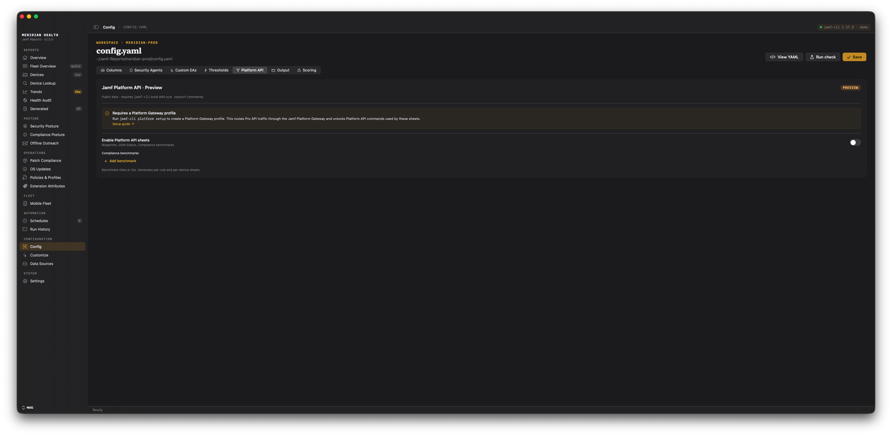

# Scheduling & Automation

Historical reporting is only as good as the cadence behind it. The app runs unattended
work through macOS **LaunchAgents** — user-scoped jobs that run as the logged-in user,
never as root.

Every run mode below collects via `jamf-cli` — there is no schedule that reads only a
CSV. A CSV-only workspace (no jamf-cli connection) can't use managed automation, the
per-schedule builder, alerts, the dead-man switch, or webhook digests; generate reports
there manually by dropping a fresh CSV export and clicking **Generate Report**.

There are two ways to schedule work, and they are mutually exclusive per host:

- **Managed automation** (recommended) — you set one policy and the app derives and
  maintains the LaunchAgents for you, across every profile. This is the primary path.
- **The per-schedule builder** — you hand-build one LaunchAgent per schedule. This is the
  original flow, kept for operators who want explicit control.

A single master toggle, **Manage automation**, switches between the two. It is **off by
default**: a fresh install manages nothing and installs no agents until you opt in.

For how to tell whether your automation is actually running — the data freshness strip,
dead-man overdue detection, metric alerts, and webhook notifications — see
[Automation Trust](https://github.com/tonyyo11/jamf-reports-community/wiki/05b-Automation-Trust).

## Managed automation — set policy, not cron jobs

The **Automation** screen (sidebar: **Automation**) is bound to a single stored policy
(`AutomationPolicy`). Turn on **Manage automation** and the app reconciles a small set of
managed LaunchAgents to match the policy — installing, updating, or removing them as the
policy changes. Turning the toggle back off tears every managed agent down.

Managed agents are **all-profiles** jobs: they resolve the current profile set at run time,
so adding or removing a workspace profile is picked up automatically with no agent to
rewrite. Profiles you list under **Excluded profiles** are skipped at run time (the
discovered set minus the exclusions) — useful for a decommissioned or paused tenant.

### The four managed agents

Enabling the policy can install up to four agents, each doing one job. They are staggered
off a single **run time** (default `06:00`) so an on-premise Jamf Pro server is not hit by
all of them at once:

| Agent | Cadence | What it does | Offset |
|---|---|---|---|
| Freshness | Daily | A light collect — the Refresh and Inventory tiers, everything except the two heavy per-device scans. Writes a daily `summary.json` per profile (one trend point/day). | +0 min |
| Scan | Weekly (default Monday) | The two `--scan-failures` fan-outs (patch + update device failures) — the per-device-heavy queries kept off the daily path. | +10 min |
| Reports | Off / Daily / Weekly / Monthly | Generates workbooks for every profile from the already-fresh cache. | +20 min |
| Backup | Weekly (default Sunday) | A `jamf-cli pro backup` of your Jamf Pro configuration objects. | +30 min |

Freshness and Scan collect data; Reports and Backup do not collect (Reports generates from
cache, Backup exports config). Each agent can be enabled independently — for example, daily
freshness with reports off.

The managed agents use reserved, fixed LaunchAgent labels
(`com.github.tonyyo11.jamf-reports-community.multi.managed-freshness`, `…managed-scan`,
`…managed-reports`, `…managed-backup`). Reconcile only ever touches those four exact
labels — never a name that merely starts with `managed-` — so a hand-built schedule of your
own is never removed by the managed layer.

## The Automation screen

Beyond the policy controls (the four agent toggles, weekdays, day-of-month, run time, and
the excluded-profiles list), the Automation screen carries three operational sections.

- **Automation Health** — a dead-man switch. It lists any managed or hand-built schedule
  that is **overdue** (should have fired and produced nothing) or **failing** (its last
  run reported failure), or reports "All scheduled runs on time." See
  [Automation Trust](https://github.com/tonyyo11/jamf-reports-community/wiki/05b-Automation-Trust) for the exact rules.
- **Notifications** — the active profile's opt-in Teams/Slack webhook: enable, choose the
  provider, paste an `https://` URL, pick a full/minimal detail level, and send a test
  card. Scheduled runs post digests, failure alerts, metric alerts, and overdue notices
  through this webhook, managed or hand-built. The same Notifications card also appears
  on the per-schedule builder (below) — notifications apply to any scheduled run, so
  there's no need to hand-edit the `notify:` block in `config.yaml` either way.
- **Report Groups** — grouping for consolidated fleet reports (below).

### Report Groups and consolidated fleet reports

A **report group** is a named set of profiles that roll up into one consolidated report. A
single org might combine `prod`, `dev`, and `sandbox` into one "fleet" group; an MSP might
make one group per customer. Grouping is an app-level policy setting, not a `config.yaml`
key. Profiles in no group keep reporting on their own, so the default (no groups) preserves
per-profile behavior.

When a report-generating run executes across all profiles, each group emits two artifacts
into `_fleet-reports/` in the workspaces root:

- A `Metric,Current,Previous,Delta` **CSV** (`FleetReportEmitter`) — device-weighted
  percentages, summed counts, and period-over-period deltas (daily 1-day / weekly 7-day /
  monthly 30-day lookback).
- A five-sheet **workbook** (`FleetWorkbookEmitter`): Fleet Summary, Per-Profile Breakdown,
  Security Posture, Compliance, and Fleet Trend, with embedded charts.

Metrics roll up across profiles; compliance bands are summed only within a shared baseline,
never across different frameworks. Missing metrics render as "—" rather than a fabricated
zero.

### Retiring redundant hand-built schedules

If you enable managed automation while old hand-built schedules are still in place, the
Automation screen surfaces a **consolidation card**: it lists hand-built schedules whose
work the managed policy now covers, and offers to retire them. Each retired schedule is
archived to `_archived-launchagents` in the workspaces root before removal, so it can be
restored if you change your mind.

## The per-schedule builder (unmanaged mode)

With **Manage automation** off, the Automation tab shows the original **Schedules** screen
— one LaunchAgent per schedule, built by hand. It carries the same **Notifications** card
described above, so the opt-in webhook is configurable here too, without switching to
managed mode.



Each schedule becomes one LaunchAgent plist and has:

- **Name** — a human-readable label.
- **Profile** — which workspace profile to run (or all profiles).
- **Cadence** — daily, a specific weekday, or monthly, at a chosen time.
- **Run mode** — what the run does (see below).
- **Collection tiers** — which data the run fetches.

Saving a schedule writes its plist, loads it into `launchd`, and can trigger an immediate
first run. "Run now" executes a schedule on demand. Both the "Run now" path and the
LaunchAgent path go through the same headless entry point, so an on-demand run and a
scheduled run behave identically.

### Run modes

Each run mode is strict — it does exactly one thing:

| Mode | Behavior | Trends updated |
|---|---|---|
| `snapshot-only` | Collect only — refreshes snapshots and writes `summary.json`, no workbook | Yes |
| `jamf-cli-only` | Generate only, from the latest cached snapshots — no collect | No |
| `jamf-cli-full` | Collect + generate, no CSV | Yes |
| `csv-assisted` | Collect + generate, using a CSV from the inbox — **hard-fails if no CSV is present** | Yes |
| `backup` | `jamf-cli pro backup` only — config objects to `backups/`, no collect, no report | No |

`csv-assisted` fails loudly when its inbox has no CSV rather than silently degrading to a
no-CSV workbook — use `jamf-cli-full` explicitly if you want the no-CSV path.

> LaunchAgent plists written before run modes existed omit `--mode` and default to
> `jamf-cli-only`. The meaning of `jamf-cli-only` later narrowed to "generate from cache,
> no collect", so a very old plist that used to collect-then-generate now only generates.
> Re-save the schedule from the GUI to migrate it.

## LaunchAgent mechanics

Both paths write to `~/Library/LaunchAgents/` with labels of the form:

```
com.github.tonyyo11.jamf-reports-community.<profile>.<slug>
```

All-profiles (multi) schedules use `…jamf-reports-community.multi.<slug>`; the managed
agents are the reserved `…multi.managed-*` labels. The app only ever manages
`~/Library/LaunchAgents` — it never installs a system-wide LaunchDaemon or requests `sudo`.
If the Mac is logged out, schedules do not run; `launchd` coalesces schedule events missed
during sleep into one run on wake.

Inspect a schedule from Terminal:

```bash
# List loaded JamfReports agents
launchctl list | grep com.github.tonyyo11.jamf-reports-community

# Print one schedule's launchd state
launchctl print "gui/$(id -u)/com.github.tonyyo11.jamf-reports-community.prod.daily"

# Force an immediate run
launchctl kickstart -k "gui/$(id -u)/com.github.tonyyo11.jamf-reports-community.prod.daily"
```

A schedule that loads but never fires usually has a malformed `StartCalendarInterval` —
`launchctl print` shows warnings near the end of its output.

### Logs

A scheduled run logs in two places:

- **launchd stdout/stderr** at `~/Library/Logs/JamfReports/<label>/stdout.log` and
  `stderr.log` — the raw process output.
- **Per-run logs** at `~/Jamf-Reports/<profile>/automation/logs/` — one file per run, read
  by the **Run History** screen (pruned to the most recent 50 per workspace).

## Collection cadence

Collection is split into three tiers by API cost, each with a fixed cloud cadence — there
is no on-prem/cloud/custom preset picker (removed in 2.3.0):

| Tier | What it fetches | Cadence |
|---|---|---|
| Refresh | Overview, security, policy-status summaries — seconds per run | Every 12 hours |
| Inventory | Device lists, profiles, apps, EA data — tens of seconds | Every 2 days |
| Scan | Full device inventory and patch/update failure scans — minutes on large fleets | Every 7 days |

These cadences gate the app's own background refresh: opening a dashboard that already has
data within its tier's window does not re-fetch. To force fresh data on demand:

- **Refresh all** — the toolbar refresh button re-collects every tier now.
- **Collect now** — each dashboard's freshness banner re-collects just that page's tier(s).
- **Catch-up on wake** — when managed freshness is on, launching or waking the Mac after a
  missed scheduled run collects that day's freshness snapshot if it hasn't happened yet
  (a no-op if it already ran today).
- **Collect now on the health strip** — when a data source is failing or far behind its
  cadence, the strip across the top of every screen offers to collect just the tiers
  behind it. See
  [Automation Trust → The data freshness strip](https://github.com/tonyyo11/jamf-reports-community/wiki/05b-Automation-Trust).

While the app is open it also re-collects a source that has fallen behind on its own, at
most once an hour and only the sources actually behind.

The app does not throttle `jamf-cli` — it inherits whatever limits your tenant enforces.
Persistent HTTP 429s in the logs mean you should stagger profiles or lean on the weekly
scan cadence rather than forcing scans more often.

## Several Macs, one workspace

When the workspace is a shared folder (**Settings → Workspace location**), scheduled
collects coordinate rather than duplicating each other. A scheduled collect **stands
down** when another Mac collected inside `shared_workspace.min_collect_interval_hours`,
naming which machine and when, and each run publishes a short claim so a second machine
can see one is already working. A run that stood down is recorded as a partial run — it
does not update Trends, send a success notification, or evaluate metric alerts, because
nothing new landed.

Pressing **Refresh** in the app always collects regardless. Coordination covers Jamf Pro
collects only. See
[Security & Operational Considerations](https://github.com/tonyyo11/jamf-reports-community/wiki/10-Security-and-Operational-Considerations)
for the layout choices and what a shared folder costs you, and
[Configuration & Templates](https://github.com/tonyyo11/jamf-reports-community/wiki/04-Configuration-and-Templates)
for the `shared_workspace` keys.

## See also

- [Automation Trust](https://github.com/tonyyo11/jamf-reports-community/wiki/05b-Automation-Trust) — dead-man detection, metric alerts, and
  webhook notifications: knowing your automation is actually running.
- [Historical Trends](https://github.com/tonyyo11/jamf-reports-community/wiki/06-Historical-Trends) — what the daily `summary.json` snapshots feed.
- [Security & Operational Considerations](https://github.com/tonyyo11/jamf-reports-community/wiki/10-Security-and-Operational-Considerations) —
  the LaunchAgent and webhook threat model.
