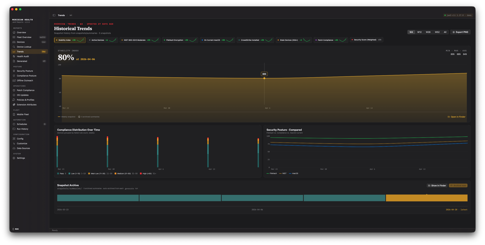

# Historical Trends

Jamf Pro shows you current state. A reporting program needs point-in-time history. The
project's model is simple: save a snapshot every run, then build timelines from those
snapshots later. Jamf will not reconstruct past state for you on demand.

## The Trends screen



The app's **Trends** screen plots fleet metrics over time — compliance, FileVault rate,
patch posture, device counts, and a weighted stability index. A metric picker switches
the hero chart; comparison charts stack compliance bands and overlay multiple series.

The trend range defaults to four weeks and is configurable in **Settings → Data &
Charts** (up to roughly a year of history).

## summary.json snapshots

Every collect or generate run writes one `summary.json` file to:

```
~/Jamf-Reports/<profile>/snapshots/computers/summaries/
```

Each file is a per-day aggregate — date, total devices, compliance percentage, FileVault
percentage, patch percentage, and related metrics. The Trends screen reads this directory;
one file equals one point on the timeline. The first run of a given day writes that day's
summary; later runs the same day leave it in place.

Because the cadence determines the granularity, **build the collection cadence first**
(see [Scheduling & Automation](05-Scheduling-and-Automation)). Weekly collection produces
weekly trend points; irregular collection produces irregular timelines.

## Two historical stores

The Python CLI's chart path uses two on-disk stores, kept separate on purpose:

- **CSV snapshot history** (`snapshots/`) — dated Jamf Pro CSV exports. The trend source
  for export-only data: Extension Attributes, compliance failure lists, department and
  manager slicing.
- **jamf-cli JSON history** (`jamf-cli-data/`) — cached API responses. The trend source
  for API-native summaries: OS adoption from `inventory-summary`, device-state trend from
  `device-compliance`, security posture from `security`.

The app's Trends screen and the CLI's chart engine both read the same `summary.json`
snapshots, so a metric tracked in one is consistent with the other. Treat `snapshots/`
and `jamf-cli-data/` as append-only — generated workbooks and PNGs are disposable output,
not the historical record.

## HTML report timeline

The self-contained HTML report renders a macOS adoption timeline once two or more
OS-version snapshots exist for the same instance. See [CLI Workflow](07-CLI-Workflow) for
the `html` command and its `track_history` option.
